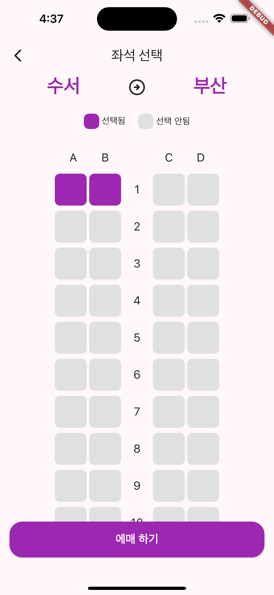
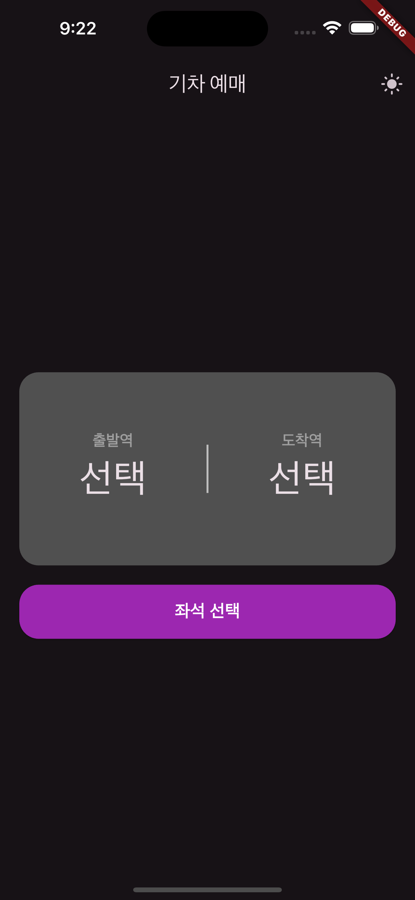

# 기차 예매 서비스

## 화면 예시

---

## 서비스 설명

- 출발역과 도착역을 지정하여 기차 좌석를 예매할 수 있는 앱입니다.
- 출발역 또는 도착역을 지정할 경우 반대편에서는 해당 역을 선택할 수 없습니다.
- 좌석은 총 80 좌석이며 여러 좌석을 예매할 수 있습니다.
- 시스템 설정에 따라 다크 모드로 사용할 수 있습니다.

## 서비스 동작 방법

- 첫 화면 상단 오른쪽에 테마 모드를 변경할 수 있는 아이콘이 있습니다.(라이트 -> 다크/다크 -> 라이트)
- 첫 화면에서 선택 부분을 누르면 출발과 도착역을 지정할 수 있는 역 리스트가 나옵니다.
- 역을 선택하면 반대편 역을 지정하여 좌석을 선택합니다.
- 출발과 도착역이 정해져 있지 않은 경우 좌석을 선택할 수 없습니다.
- 좌석 선택 버튼을 누를 경우 선택할 수 있는 좌석이 나옵니다.
- 선택할 경우 보라색으로 좌석 색이 변경되며 1개 이상의 좌석을 선택해야만 예매가 가능합니다.
- 좌석을 선택하여 예매 하기 버튼을 누르면 좌석 번호와 함께 예매 확인 알림창이 뜹니다.
- 취소를 누를 경우 예매가 되지 않고, 확인을 누를 경우 예매가 완료되며 홈 화면으로 이동하게 됩니다.
